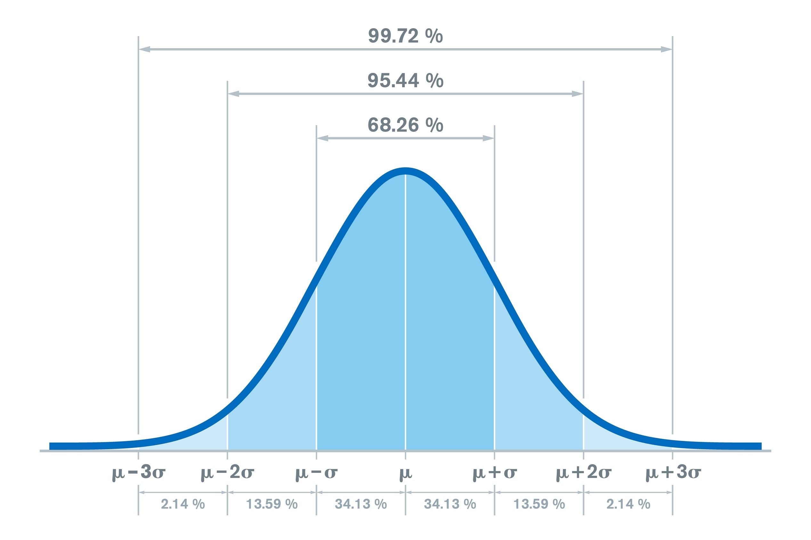
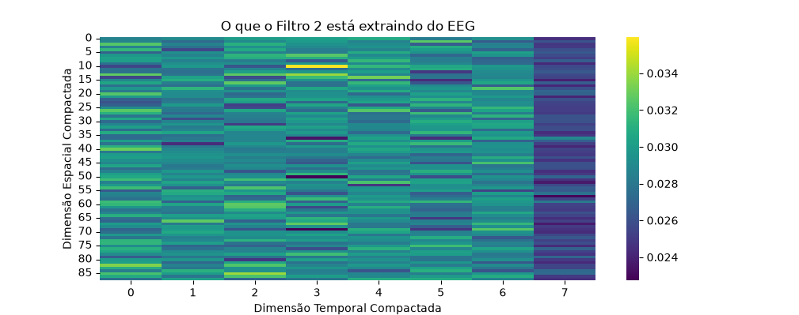

Modelo: CBraMOd.

# Entendendo as camadas

O modelo possui as seguintes camadas:

```
patch_embedding.positional_encoding.0 | Tipo: Conv2d
patch_embedding.proj_in.0 | Tipo: Conv2d
patch_embedding.proj_in.1 | Tipo: GroupNorm
patch_embedding.proj_in.2 | Tipo: GELU
patch_embedding.proj_in.3 | Tipo: Conv2d
patch_embedding.proj_in.4 | Tipo: GroupNorm
patch_embedding.proj_in.5 | Tipo: GELU
patch_embedding.proj_in.6 | Tipo: Conv2d
patch_embedding.proj_in.7 | Tipo: GroupNorm
patch_embedding.proj_in.8 | Tipo: GELU
patch_embedding.spectral_proj.0 | Tipo: Linear
patch_embedding.spectral_proj.1 | Tipo: Dropout
encoder.layers.0.self_attn_s.out_proj | Tipo: NonDynamicallyQuantizableLinear
encoder.layers.0.self_attn_t.out_proj | Tipo: NonDynamicallyQuantizableLinear
encoder.layers.0.linear1 | Tipo: Linear
encoder.layers.0.dropout | Tipo: Dropout
encoder.layers.0.linear2 | Tipo: Linear
encoder.layers.0.norm1 | Tipo: LayerNorm
encoder.layers.0.norm2 | Tipo: LayerNorm
encoder.layers.0.dropout1 | Tipo: Dropout
encoder.layers.0.dropout2 | Tipo: Dropout
encoder.layers.1.self_attn_s.out_proj | Tipo: NonDynamicallyQuantizableLinear
encoder.layers.1.self_attn_t.out_proj | Tipo: NonDynamicallyQuantizableLinear
encoder.layers.1.linear1 | Tipo: Linear
encoder.layers.1.dropout | Tipo: Dropout
encoder.layers.1.linear2 | Tipo: Linear
encoder.layers.1.norm1 | Tipo: LayerNorm
encoder.layers.1.norm2 | Tipo: LayerNorm
encoder.layers.1.dropout1 | Tipo: Dropout
encoder.layers.1.dropout2 | Tipo: Dropout
encoder.layers.2.self_attn_s.out_proj | Tipo: NonDynamicallyQuantizableLinear
encoder.layers.2.self_attn_t.out_proj | Tipo: NonDynamicallyQuantizableLinear
encoder.layers.2.linear1 | Tipo: Linear
encoder.layers.2.dropout | Tipo: Dropout
encoder.layers.2.linear2 | Tipo: Linear
encoder.layers.2.norm1 | Tipo: LayerNorm
encoder.layers.2.norm2 | Tipo: LayerNorm
encoder.layers.2.dropout1 | Tipo: Dropout
encoder.layers.2.dropout2 | Tipo: Dropout
encoder.layers.3.self_attn_s.out_proj | Tipo: NonDynamicallyQuantizableLinear
encoder.layers.3.self_attn_t.out_proj | Tipo: NonDynamicallyQuantizableLinear
encoder.layers.3.linear1 | Tipo: Linear
encoder.layers.3.dropout | Tipo: Dropout
encoder.layers.3.linear2 | Tipo: Linear
encoder.layers.3.norm1 | Tipo: LayerNorm
encoder.layers.3.norm2 | Tipo: LayerNorm
encoder.layers.3.dropout1 | Tipo: Dropout
encoder.layers.3.dropout2 | Tipo: Dropout
encoder.layers.4.self_attn_s.out_proj | Tipo: NonDynamicallyQuantizableLinear
encoder.layers.4.self_attn_t.out_proj | Tipo: NonDynamicallyQuantizableLinear
encoder.layers.4.linear1 | Tipo: Linear
encoder.layers.4.dropout | Tipo: Dropout
encoder.layers.4.linear2 | Tipo: Linear
encoder.layers.4.norm1 | Tipo: LayerNorm
encoder.layers.4.norm2 | Tipo: LayerNorm
encoder.layers.4.dropout1 | Tipo: Dropout
encoder.layers.4.dropout2 | Tipo: Dropout
encoder.layers.5.self_attn_s.out_proj | Tipo: NonDynamicallyQuantizableLinear
encoder.layers.5.self_attn_t.out_proj | Tipo: NonDynamicallyQuantizableLinear
encoder.layers.5.linear1 | Tipo: Linear
encoder.layers.5.dropout | Tipo: Dropout
encoder.layers.5.linear2 | Tipo: Linear
encoder.layers.5.norm1 | Tipo: LayerNorm
encoder.layers.5.norm2 | Tipo: LayerNorm
encoder.layers.5.dropout1 | Tipo: Dropout
encoder.layers.5.dropout2 | Tipo: Dropout
encoder.layers.6.self_attn_s.out_proj | Tipo: NonDynamicallyQuantizableLinear
encoder.layers.6.self_attn_t.out_proj | Tipo: NonDynamicallyQuantizableLinear
encoder.layers.6.linear1 | Tipo: Linear
encoder.layers.6.dropout | Tipo: Dropout
encoder.layers.6.linear2 | Tipo: Linear
encoder.layers.6.norm1 | Tipo: LayerNorm
encoder.layers.6.norm2 | Tipo: LayerNorm
encoder.layers.6.dropout1 | Tipo: Dropout
encoder.layers.6.dropout2 | Tipo: Dropout
encoder.layers.7.self_attn_s.out_proj | Tipo: NonDynamicallyQuantizableLinear
encoder.layers.7.self_attn_t.out_proj | Tipo: NonDynamicallyQuantizableLinear
encoder.layers.7.linear1 | Tipo: Linear
encoder.layers.7.dropout | Tipo: Dropout
encoder.layers.7.linear2 | Tipo: Linear
encoder.layers.7.norm1 | Tipo: LayerNorm
encoder.layers.7.norm2 | Tipo: LayerNorm
encoder.layers.7.dropout1 | Tipo: Dropout
encoder.layers.7.dropout2 | Tipo: Dropout
encoder.layers.8.self_attn_s.out_proj | Tipo: NonDynamicallyQuantizableLinear
encoder.layers.8.self_attn_t.out_proj | Tipo: NonDynamicallyQuantizableLinear
encoder.layers.8.linear1 | Tipo: Linear
encoder.layers.8.dropout | Tipo: Dropout
encoder.layers.8.linear2 | Tipo: Linear
encoder.layers.8.norm1 | Tipo: LayerNorm
encoder.layers.8.norm2 | Tipo: LayerNorm
encoder.layers.8.dropout1 | Tipo: Dropout
encoder.layers.8.dropout2 | Tipo: Dropout
encoder.layers.9.self_attn_s.out_proj | Tipo: NonDynamicallyQuantizableLinear
encoder.layers.9.self_attn_t.out_proj | Tipo: NonDynamicallyQuantizableLinear
encoder.layers.9.linear1 | Tipo: Linear
encoder.layers.9.dropout | Tipo: Dropout
encoder.layers.9.linear2 | Tipo: Linear
encoder.layers.9.norm1 | Tipo: LayerNorm
encoder.layers.9.norm2 | Tipo: LayerNorm
encoder.layers.9.dropout1 | Tipo: Dropout
encoder.layers.9.dropout2 | Tipo: Dropout
encoder.layers.10.self_attn_s.out_proj | Tipo: NonDynamicallyQuantizableLinear
encoder.layers.10.self_attn_t.out_proj | Tipo: NonDynamicallyQuantizableLinear
encoder.layers.10.linear1 | Tipo: Linear
encoder.layers.10.dropout | Tipo: Dropout
encoder.layers.10.linear2 | Tipo: Linear
encoder.layers.10.norm1 | Tipo: LayerNorm
encoder.layers.10.norm2 | Tipo: LayerNorm
encoder.layers.10.dropout1 | Tipo: Dropout
encoder.layers.10.dropout2 | Tipo: Dropout
encoder.layers.11.self_attn_s.out_proj | Tipo: NonDynamicallyQuantizableLinear
encoder.layers.11.self_attn_t.out_proj | Tipo: NonDynamicallyQuantizableLinear
encoder.layers.11.linear1 | Tipo: Linear
encoder.layers.11.dropout | Tipo: Dropout
encoder.layers.11.linear2 | Tipo: Linear
encoder.layers.11.norm1 | Tipo: LayerNorm
encoder.layers.11.norm2 | Tipo: LayerNorm
encoder.layers.11.dropout1 | Tipo: Dropout
encoder.layers.11.dropout2 | Tipo: Dropout
proj_out | Tipo: Identity
```

## Bloco patch_embedding (Processamento inicial)

Dado que o input tem a forma `(batch, 22 canais, 4 segmentos, 200 pontos)`, o modelo não joga isso direto no Transformer.

- `positional_encoding.0 (Conv2d)` - Como os Transformers processam tudo em paralelo, eles perdem a noção de ordem do sinal. Esta convolução injeta a informação de "tempo" e "posição geográfica" dos eletrodos na matriz.

- `proj_in (Conv2d -> GroupNorm -> GELU)` - Sequência repetida de convoluções profundas. Elas funcionam como filtros que reduzem o tamanho do sinal temporal puro e extraem as features locais mais importantes.
    - _GroupNorm_ - Normalia as ativações para que o treino seja estável.
    - _GELU_ - Função de ativação que adiciona não-linearidade à rede.
- `spectral_proj (Linear->Dropout)` - Camada que faz projeção linear. Pega mapas de features gerados pelas convoluções e os mapeia para a dimensão correta exigida pelas camadas do Transformer.

## Bloco encoder.layers (Cérebro do modelo)

O modelo possui 12 blocos de codificação (de `0` a `11`).

- `self_attn_s` **(Spatial Attention)** - Calcula a correlação entre os 22 canais (eletrodos) do EEG. (quais áreas do cérebro ativam juntas ou se comunicam mais?)

- `self_attn_t` **(Temporal Attention)** - Calcula a correlação entre os 4 segmentos de tempo. (quais momentos específicos foram decisivos para identificar uma classe?)

- `linear1` e `linear2` - Camadas de _Feed_Forward_ padrão do Transformer. Processam os insights combinados gerados por `self_attn_s` e `self_attn_t`.

- `norm1` e `norm2` - Normalizam os outputs para uma escala estável, para evitar que os gradientes explodam/sumam.

# Análise

## Analisando output de patch_embedding.proj_in.8

Colocamos um Hook do PyTorch na camada que dá como output o que tem dentro dela. Ao rodarmos o modelo com o seguinte dado inicial:

```py
# 3. Rodar o modelo normalmente com o dado de teste
mock_eeg = torch.randn((8, 22, 4, 200)).to(device)
saida_base = model(mock_eeg)

# 4. Rodar o classificador em seguida
logits = classifier(saida_base)
```

Recebemos o output:

```
Formato (Shape) dos dados capturados: torch.Size([8, 25, 88, 8])
```

O que isso significa?

Primeiro, vamos entender o input. Ele consiste em um tensor de 4 dimensões [Batch Size, Channels, Time Segment, Points per Patch].

- **Batch Size** - Quantidade de amostras de EEG que serão enviadas para a IA processar em paralelo. Podem ser 8 trechos de exames de pacientes diferentes, ou 8 janelas de tempo seguidas do mesmo paciente.

- **Channels** - Indica que 22 foram utilizados para coletar o sinal. Cada canal traz o sinal de uma região específica do cérebro.

- **Time Segments** - Indica em quantos blocos o sinal total gravado foi dividido. 
    - Assim, ao invés de olhar para o exame inteiro de uma vez, o modelo divide o tempo em 4 partes menores para analisar a evolução do sinal ao longo do experimento (ex: seg1 = Início do estímulo, seg4 = fim do estímulo).

- **Points per Patch** - Quantidade de dados digitais (leituras de voltagem) contidos dentro de cada um dos 4 segmentos, para cada um dos 22 canais. 
    - Se o aparelho coleta dados a uma taxa de amostragem de 200Hz (200 pontos por segundo), significa que cada uma das 4 janelas terá exatamente 1 segundo de duração (pois usamos 200)
.

Isso nos dá um tensor: No exemplo do EEG, o formato (8, 22, 4, 200) significa : uma lista mãe com 8 itens (lotes). Dentro de cada item, há uma lista com 22 itens (eletrodos). Dentro de cada eletrodo, uma lista com 4 itens (janelas de tempo). E dentro de cada janela, uma lista final com 200 números puros (as voltagens). E colocamos números aleatórios dentro de cada um.

Detalhe: `n` no final de `randn` significa **Normal** (ou Gaussiana).



Agora, podemos entender o output `torch.Size([8, 25, 88, 8])`.

1. **8 (Batch Size)**: É a quantidade de pacientes/testes processados juntos.

2. **25 (Canais de Features / Filtros)**: A rede convolucional criou 25 tipos de sinais diferentes combinando seus 22 eletrodos originais. **Cada um desses 25 canais foca em um padrão** (ex: um pode focar em picos agudos, outro em ondas lentas).

3. **88 (Tempo/Espaço Compactado - Linhas da Matriz)** - As camadas de convolução anteriores foram reduzindo e combinando os 200 pontos de tempo originais. Essas 88 linhas são os componentes temporais resumidos que o modelo achou relevants.

4. **8 (Tempo/Espaço Compactado - Colunas da Matriz)** - Dentro das 88 linhas, temos 8 números puros.

Esse output de 88x8 é pré-definido na arquitetura do modelo. Ele é calculado com base em 4 fatores: (Tamanho do Input, Kernel SIze, Stride, Padding).

### Nível de ativação por filtro (cada um dos 25)

Agora vamos analisar o nível de ativação de cada um dos filtros (que determinam que um padrão abstrato foi detectado) diante de um input aleatório.

Cada um dos 25 filtros funciona como um especialista em procurar uma assinatura visual/frequência específica dentro do sinal de EEG.

Ex:

- O Filtro 0 é especialista em detectar ondas lentas (ritmo Delta).

- O Filtro 1 é especialista em detectar picos abruptos de voltagem (picos epilépticos).

- O Filtro 2 é especialista em detectar oscilações rápidas (ritmo Beta).

No código, rodamos `dados_paciente.mean(dim=[1, 2])`, que tira a média de todos os números da matriz `88x8` de cada filtro.

- **Nível de Ativação Alto (ex: 1.8542):** - O especialista encontrou intensamente o padrão dele ao longo de todo o tempo/espaço do exame;

- **Nível de Ativação Próximo a Zero (ex: 0.0211)**: O padrão que esse filtro procura simplesmente não aconteceu ou foi irrelevante nesse trecho do exame.

Rodando para um input aleatório:

```
Camada analisada: patch_embedding.proj_in.8
Formato (Shape) dos dados capturados: torch.Size([8, 25, 88, 8])
Filtro Conv. 0: Ativação = 0.0126
Filtro Conv. 1: Ativação = 0.0143
Filtro Conv. 2: Ativação = 0.0286
Filtro Conv. 3: Ativação = 0.0100
Filtro Conv. 4: Ativação = -0.0138
Filtro Conv. 5: Ativação = 0.0005
Filtro Conv. 6: Ativação = 0.0130
Filtro Conv. 7: Ativação = 0.0090
Filtro Conv. 8: Ativação = 0.0085
Filtro Conv. 9: Ativação = -0.0033
Filtro Conv. 10: Ativação = 0.0032
Filtro Conv. 11: Ativação = 0.0067
Filtro Conv. 12: Ativação = 0.0088
Filtro Conv. 13: Ativação = -0.0014
Filtro Conv. 14: Ativação = -0.0007
Filtro Conv. 15: Ativação = 0.0026
Filtro Conv. 16: Ativação = 0.0063
Filtro Conv. 17: Ativação = -0.0009
Filtro Conv. 18: Ativação = -0.0144
Filtro Conv. 19: Ativação = 0.0000
Filtro Conv. 20: Ativação = -0.0056
Filtro Conv. 21: Ativação = -0.0064
Filtro Conv. 22: Ativação = 0.0051
Filtro Conv. 23: Ativação = 0.0118
Filtro Conv. 24: Ativação = 0.0076
```

Podemos ver que praticamente todos os filtros tiveram uma ativação baixa. Isso faz sentido, já que o input não é um sinal real, mas apenas números aleatórios. Ou seja, a CNN entende que não há padrões ali.

Analisando o output do filtro de maior ativação:



## Analisando Classifier

Para a saída do classifier, temos:

```
model.proj_out = nn.Identity()
classifier = nn.Sequential(
  Rearrange('b c s p -> b (c s p)'),
  nn.Linear(22*4*200, 4*200),
  nn.ELU(),
  nn.Dropout(0.1),
  nn.Linear(4 * 200, 200),
  nn.ELU(),
  nn.Dropout(0.1),
  nn.Linear(200, 4),
).to(device)
```

- `model.proj_out = nn.Identity()` - O CBraMod oiginal vinha com uma camada de saída na ponta final chamada `proj_out`, configurada para classificar alguma outra base de dados. Ao fazer isso, estamos substituindo essa camada final por uma **Camada Identidade**. Ela não faz nada, tudo que entra sai igual.

- `classifier = nn.Sequential(...)` - Aqui constrói-se uma nova rede neural sequencial, camada por camada, para processar as features que o modelo extraiu.
    - `Rearrange('b c s p -> b (c s p)')` - Camada de achatamento. Pega o tensor 4D no formato `(b)atch, (c)anais, (s)egmentos, (p)ontos` e multiplica as 3 últimas dimensões.
        - Se o dado era `(8, 22, 4, 200)`, ele vira `(8, 17600)`. Agora, todas as informações de espaço e tempo viraram uma única linha gigante com 17.600 números por paciente.
    - `nn.Linear(22*4*200, 4*200)` - Uma Dense/Linear Layer que pega os 17 600 números de entrada e, através de pesos, reduz essa informação para 800 números.
    - `nn.ELU()` - Função de ativação. Decide quais neurônios disparam.
    - `nn.Dropout(0.1)` - Técnica de regularização contra o _overfitting_ (decorar dados de treino). Desliga aleatoriamente 10% dos neurÔnios.
    - `nn.Linear(4 * 200, 200) -> nn.ELU() -> nn.Dropout(0.1)` - Uma segunda redução. Transforma os 800 números anteriores em 200 features. Aplica ativação e dropout de novo.
    - `nn.Linear(200,4)` - Pega as 200 features e reduz para 4 números. Cada um deles representa a pontuação para cada uma das 4 classes do EEG.

Note que essa nova camada de classificação (Neural Network) não é treinada em nenhum momento. Então ela só cospe números aleatórios.

E quanto à saída que ele nos dá:

```
torch.Size([8, 4])
```

Ou seja, 8 pacientes, 4 classes avaliadas para cada um.

### Adicional: nn do PyTorch

Ferramenta interessante para criar e treinar redes neurais.

```py
import torch
import torch.nn as nn
import torch.optim as optim

# 1. Dados de treino quaisquer (100 exemplos, cada um com 2 números)
X = torch.randn(100, 2)
# Classes alvo corretas para cada exemplo (números entre 0 e 2)
y = torch.randint(0, 3, (100,))

# 2. Definição da Rede Neural (Entra 2 -> Sai 3)
modelo = nn.Sequential(
    nn.Linear(2, 4),   # Camada oculta
    nn.ReLU(),         # Ativação
    nn.Linear(4, 3)    # Camada de saída (3 classes)
)

# 3. Configuração do Erro e do Otimizador
funcao_perda = nn.CrossEntropyLoss()
otimizador = optim.SGD(modelo.parameters(), lr=0.1) # Ajusta os pesos da rede

# 4. Loop de Treinamento (Rodando 50 vezes sobre os dados)
for epoca in range(50):
    # Zera o histórico de erros do otimizador
    otimizador.zero_grad()
    
    # Passo 1: Previsão (Forward)
    palpites = modelo(X)
    
    # Passo 2: Calcula o erro (Loss)
    perda = funcao_perda(palpites, y)
    
    # Passo 3: Descobre quem errou na rede (Backward)
    perda.backward()
    
    # Passo 4: Atualiza os pesos para corrigir o erro (Step)
    otimizador.step()
    
    # Imprime o progresso a cada 10 épocas
    if (epoca + 1) % 10 == 0:
        print(f"Época {epoca + 1}/50 | Erro (Loss): {perda.item():.4f}")
```

Para salvar a rede treinada, dê `pip install safetensors`.

```py
from safetensors.torch import save_model

# 'modelo' é a sua rede neural que acabou de ser treinada
# 'pesos_treinados.safetensors' é o nome do arquivo que será criado
save_model(modelo, "pesos_treinados.safetensors")

print("Rede neural salva")
```

Para resgatar a rede salva:

```py
import torch
import torch.nn as nn
from safetensors.torch import load_model

# Passo 1: Você DEVE recriar a EXATA mesma estrutura da rede
modelo_resgatado = nn.Sequential(
    nn.Linear(2, 4),
    nn.ReLU(),
    nn.Linear(4, 3)
)

# Passo 2: Carregar os pesos salvos direto para dentro dessa estrutura vazia
load_model(modelo_resgatado, "pesos_treinados.safetensors")

# Passo 3: Colocar em modo de avaliação (pronto para usar/prever)
modelo_resgatado.eval()

print("Rede neural resgatada e pronta para uso!")
```