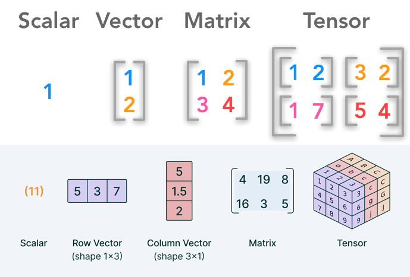

# Criando ambiente virtual (conda/venv)

O ambiente virtual é uma ferramenta que cria um espaço isolado no seu computador para o desenvolvimento de um projeto específico.

Ele evita conflito de versões para diferentes projetos, criando uma pasta dentro do projeto que é ativada, onde as bibliotecas são instaladas.

Utilizando conda:

```py
# Criando
conda create --name nome_ambiente linguagem_base bibliotecas

# Exemplos
conda create --name env_cpp gcc_linux-64 gxx_linux-64 cmake
conda create --name projeto_web python=3.11 flask
conda create -n brainomni python=3.10.14

# Ativando
conda activate brainomni

# Desativando
conda deactivate brainomni
```

Utilizando venv (o venv é focado exclusivamente em Python):

```py
# Criar ambiente
python -m venv nome_env

# Ativar ambiente (Linux)
source nome_env/bin/activate

# Desativar
deactivate
```

O legal disso é que, ao baixar um repositório, basta ativar o ambiente virtual e as bibliotecas já estarão prontinhas.

## Utilizando requirements.txt

Quase todo projeto tem um arquivo chamado `requirements.txt` onde estão todas as bibliotecas necessárias para o projeto rodar. Para instalá-las:

```
pip install -r requirements.txt
```

# Hugging Face

É um "GitHub para IA". Lá o pessoal compartilha modelos de ML pré-treinados, datasets e demos.

## Usando modelos pré-treinados com pipeline

Primeiro, instale a biblioteca deles: `transformers` e o PyTorch.

```
pip install transformers torch
```

A Hugging Face criou uma abstração chamada `pipeline`. Com ela, só precisa dizer qual é a tarefa (ex: análise de sentimento, tradução) e ela baixa e configura o modelo automaticamente.

```py
from transformers import pipeline

# 1. Cria o pipeline de análise de sentimento (baixa um modelo pré-treinado padrão)
classificador = pipeline("sentiment-analysis")

# 2. Usa o modelo
resultado = classificador("Eu estou adorando aprender sobre Inteligência Artificial!")

print(resultado)
# Saída esperada: [{'label': 'POSITIVE', 'score': 0.9998}]
```

Ou para usar um modelo específico:

```py
# Usando um modelo específico para o português (ex: BERTimbau)
classificador_pt = pipeline(
    "sentiment-analysis", 
    model="nlptown/bert-base-multilingual-uncased-sentiment"
)
```

## Usando modelos pré-treinados sem pipeline

Para usar os modelos sem o pipeline, deve-se trabalhar diretamente com o Tokenizer (converte textos em números e tensores) e o Model (Recebe esses números e os processa).

```py
import torch
from transformers import AutoTokenizer, AutoModelForSequenceClassification

# 1. Definir o modelo do Hub
model_name = "distilbert-base-uncased-finetuned-sst-2-english"

# 2. Carregar o Tokenizador e o Modelo explicitamente
tokenizer = AutoTokenizer.from_pretrained(model_name)
model = AutoModelForSequenceClassification.from_pretrained(model_name)

# 3. Preparar o texto de entrada
texto = "I am absolutely loving this deep dive into AI!"

# 4. Tokenizar o texto (Converte para tensores do PyTorch)
inputs = tokenizer(texto, return_tensors="pt")

# 5. Passar os inputs pelo modelo (Sem calcular gradientes para economizar memória)
with torch.no_grad():
    outputs = model(**inputs)

# 6. Processar a saída bruta (Logits)
logits = outputs.logits
print("Logits brutos:", logits)

# 7. Aplicar Softmax para converter logits em probabilidades (0 a 1)
predicoes = torch.nn.functional.softmax(logits, dim=-1)
print("Probabilidades:", predicoes)

# 8. Descobrir a classe com maior probabilidade
classe_id = torch.argmax(predicoes).item()
label = model.config.id2label[classe_id]

print(f"Resultado final: {label} (Confiança: {predicoes[0][classe_id]:.4f})")
```

## Usando pesos pré-treinados

Pesos são arquivos `.pt` ou `.pth` gerados pelo PyTorch. Eles são utilizados para rodar modelos já existentes.

```py
from huggingface_hub import hf_hub_download

caminho_arquivo = hf_hub_download(
    repo_id="nome-do-usuario/nome-do-repositorio",
    filename="modelo.pth",
    local_dir="./meu_caminho_customizado/modelos/"  # <--- Defina seu caminho aqui
)

print(f"Arquivo salvo em: {caminho_arquivo}")

# Agora é só carregar com o PyTorch
pesos = torch.load(caminho_arquivo)
```

Como exemplo no CBraMod:

```py
# Seleciona onde vamos rodar o PyTorch (CPU/GPU)
device = torch.device("cuda:0" if torch.cuda.is_available() else "cpu")
# Diz ao CBraMod
model = CBraMod().to(device)
# Carrega pesos pré-treinados
model.load_state_dict(torch.load('pretrained_weights/pretrained_weights.pth', map_location=device))
```

# Tensores

Tensores são generalizações de matrizes para N dimensões.



- Tensor 1D = Escalar - `1`
- Tensor 2D = Vetor - `[1,2]`
- Tensor 3D = Matriz - `[[1,2],[3,4]]`
- Tensor 4D = Matriz onde cada elemento é uma matriz - `[[[1,2],[3,4]],[[1,2],[3,4]]]`

É bem simples. Basta substituir cada elemento por um vetor a cada dimensão adicionada.